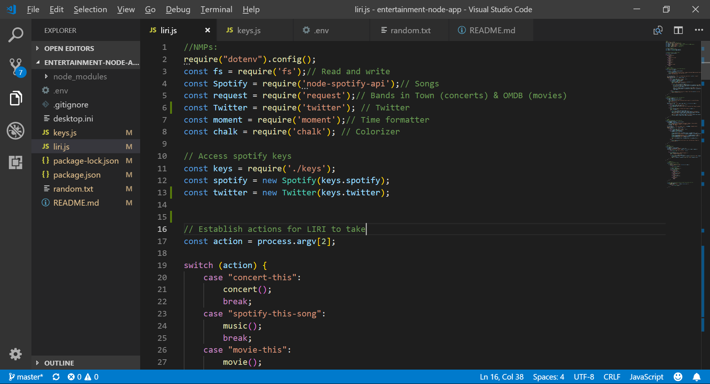

This entertainment-node-app is a Language Interpretation and Recognition Interface, or LIRI for short.  LIRI's main function is to take specific parameters for simple entertainment-related search requests and return relevant results.  Feed LIRI a movie title, band/ artist name, song title, or Tweet request and she will provide you with more details regarding these queries.  LIRI will also keep a log of results from her searches.

__Functionality:__ LIRI is coded with Javascript and uses Node packages to work her magic.  She provides her search results by API calls to Bands in Town, Spotify, OMDB, and Twitter.

__How to use LIRI: Enter any of these request in LIRI's terminal:
>*concert-this 'artist/band name'
>*spotify-this-song 'song title'
>*movie-this 'movie title'
>*my-tweets  (this returns a list of Julie’s tweets)

https://drive.google.com/file/d/1s02dRll2ZxZ-oLTnUAOc5jgiX8Q5LfLN/view?usp=sharing - automatic!
[_See LIRI in action:_](https://drive.google.com/file/d/1s02dRll2ZxZ-oLTnUAOc5jgiX8Q5LfLN/view?usp=sharing)

__Surprise me!__ LIRI will also respond to the command  <do-what-it-says>  in the terminal and return results for the movie, song, tweet, or concert has been secretly entered in a random text file. 

https://drive.google.com/file/d/1O-_s5-t1x-rxdeaYYR1a7DQyav-QPJRA/view?usp=sharing - automatic!
[What did LIRI do?](https://drive.google.com/file/d/1O-_s5-t1x-rxdeaYYR1a7DQyav-QPJRA/view?usp=sharing)

__What did LIRI do?__
As she works, LIRI creates a log file then appends her search results within the log.  In the image below, notice that LIRI has not yet created a log.   

Format: 

https://drive.google.com/file/d/10eRlifFlZgwJKmaoPVnbbnzry0K5_t_G/view?usp=sharing - automatic!
[__Show me the log!__](https://drive.google.com/file/d/10eRlifFlZgwJKmaoPVnbbnzry0K5_t_G/view?usp=sharing)
Demonstrates how LIRI appends data from her searches. 
