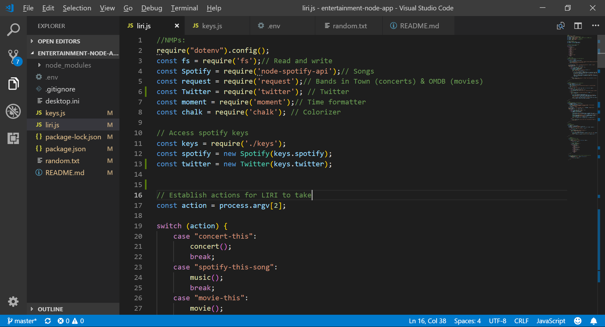

## ABOUT LIRI ##

This entertainment-node-app is a Language Interpretation and Recognition Interface, or LIRI for short.  LIRI's main function is to take specific parameters for simple entertainment-related search requests and return relevant results.  Feed LIRI a movie title, band/ artist name, song title, or Tweet request and she will provide you with more details regarding these queries.  LIRI also keeps a log of results from her searches.

__Functionality:__ LIRI is coded with Javascript and uses Node packages to work her magic.  She provides her search results by API calls to Bands in Town, Spotify, OMDB, and Twitter.

__How to use LIRI:__ Enter any of these request in LIRI's terminal:
* concert-this 'artist/band name'
* spotify-this-song 'song title'
* movie-this 'movie title'
* my-tweets  (this returns a list of Julie’s tweets)

[_VIDEO: Let me see LIRI in action!_](https://drive.google.com/file/d/1s02dRll2ZxZ-oLTnUAOc5jgiX8Q5LfLN/view?usp=sharing)

__Surprise me!__ LIRI will also respond to the terminal command "do-what-it-says" and return results for the movie, song, tweet, or concert has been secretly entered in a random text file. 

[_VIDEO: What did LIRI do?_](https://drive.google.com/file/d/1O-_s5-t1x-rxdeaYYR1a7DQyav-QPJRA/view?usp=sharing)

__Log that!__
As she works, LIRI creates a log file then appends her search results within the log.  In the image below, notice that LIRI has not yet created a log.   

[_VIDEO: Show me the log!_](https://drive.google.com/file/d/10eRlifFlZgwJKmaoPVnbbnzry0K5_t_G/view?usp=sharing)

